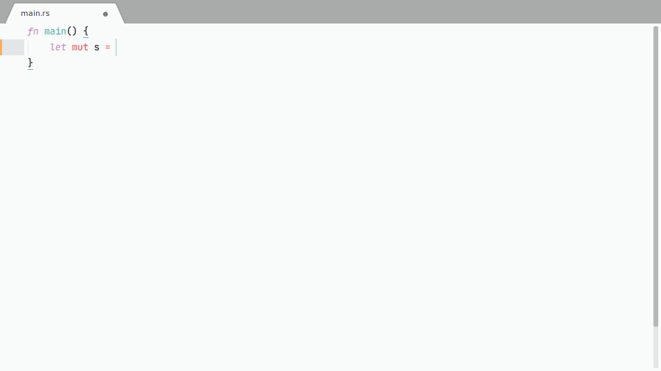
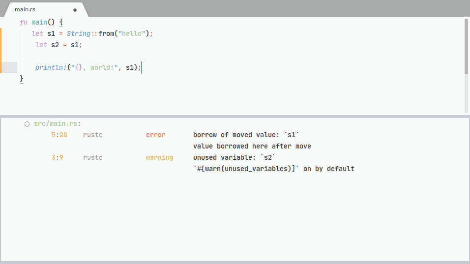
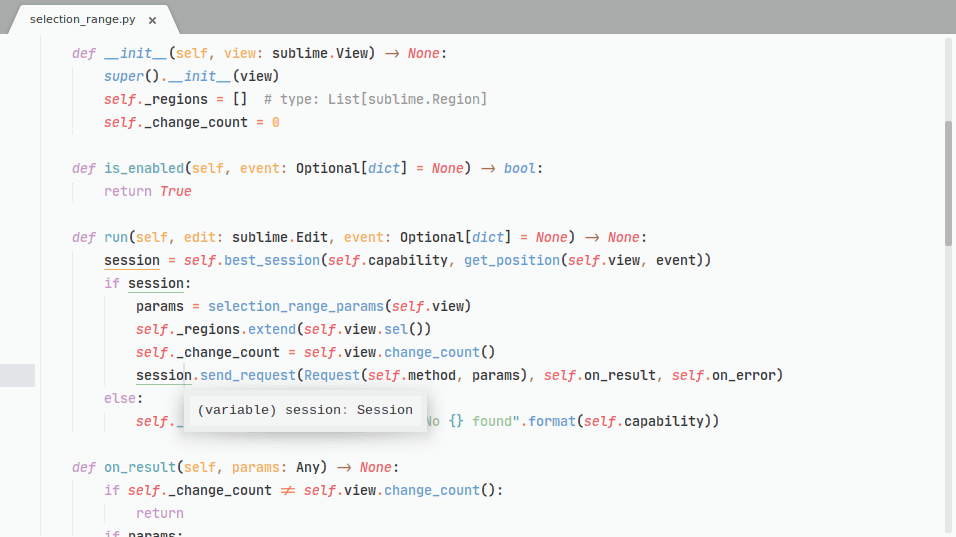
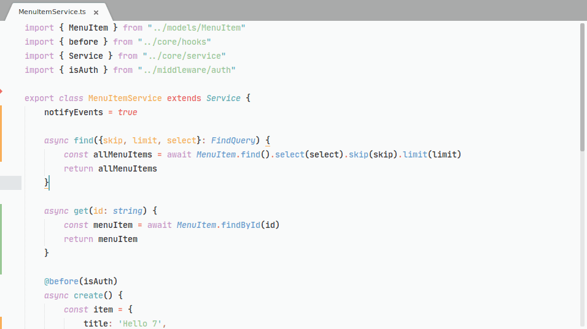
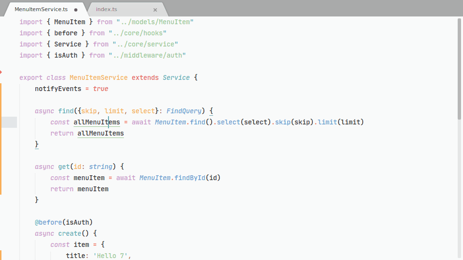
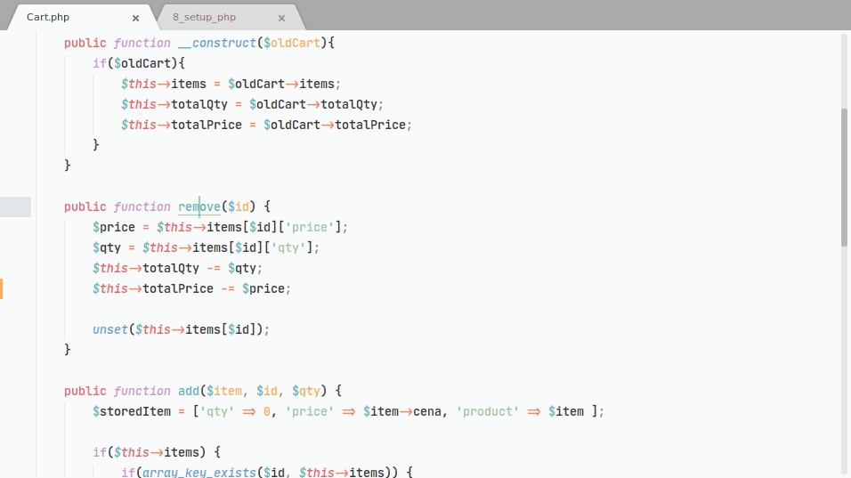
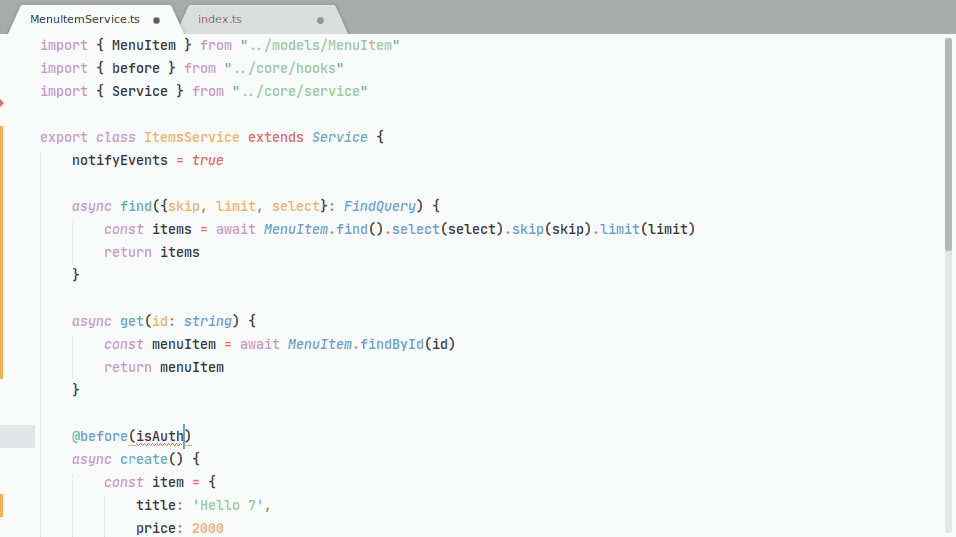

# Getting Started

## Introduction

LSP for Sublime Text implements the [Language Server Protocol](https://microsoft.github.io/language-server-protocol/) and it provides features like auto complete, go to definition, find all references etc.

All features are powered by a language server. A language server provides intelligent code completions based on language semantics and an analysis of your source code.

=== "Smart auto complete"

    <small>
        Get smart code completion. Press <kbd>f12</kbd> to trigger the documentation popup.
    </small>

    

=== "Diagnostics"

    <small>
        From the command palette select <code>LSP: Toggle Diagnostics Panel</code> to open the diagnostics panel. Use <kbd>F4</kbd> and <kbd>shift+f4</kbd> to go to the next/previous diagnostic.
    </small>

    

=== "Go to definition"

    <small>
        Go to symbol definition, type definition, declaration or implementation.
    </small>

    

=== "Find references"

    <small>
        Find all symbol references across the project. Use <kbd>F4</kbd> and <kbd>shift+f4</kbd> to go to the next/previous reference.
    </small>

    

=== "Rename symbol"

    <small>
        Rename the symbol name accross the project.
    </small>

    

=== "Document highlight"

    <small>
        <u>Highlights</u> all references to the symbol scoped to the opened file.
    </small>

    

=== "Code actions"

    <small>
        Run commands to fix problems or to refactor code. Code actions can be triggered on save to automatically format your document or to organize imports.
    </small>

    

## Installation

* Install [LSP](https://packagecontrol.io/packages/LSP) from Package Control.
* Add a [language server](language_servers.md).
    
Go to the next step to see how to add a language server.